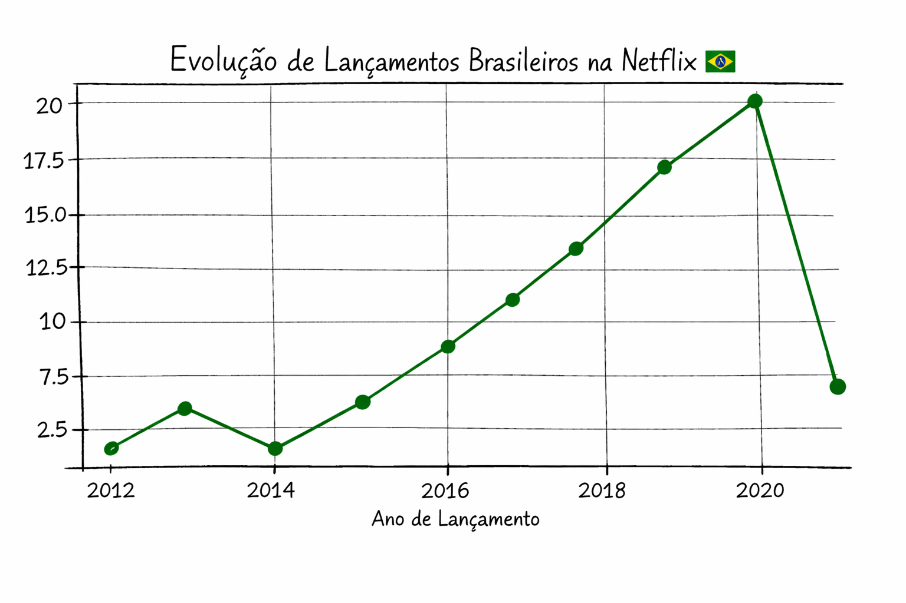

# 📺 Projeto de Análise de Dados: Filmes da netflix

Este repositório tem como objetivo análisar os dados apartir do arquivo "netflix_titles.csv". 

"Este arquivo é o dataset oficial da Netflix (disponível no Kaggle), que contém um inventário de quase 9 mil títulos lançados na plataforma até meados de 2021.

Ele agrupa metadados detalhados de filmes e séries de mais de 70 países, permitindo analisar tendências globais de entretenimento, elencos mais frequentes e a evolução do catálogo ao longo das décadas."

Nesse projeto vai ser apresentado um gráfico criado em python junto das Bibliotecas Pandas e Matplotlib com base nesse arquivo.

---

## 📈 1. Evolução de Lançamentos Brasileiros (Gráfico de Linhas)
Este gráfico utiliza a **contagem anual** para monitorar o crescimento da produção nacional no catálogo. É a melhor forma de visualizar o investimento histórico da Netflix no Brasil ao longo dos anos.

* **O que ele mostra:** O ritmo de crescimento e os picos de lançamentos (como o visto em 2020).
* **Função principal:** `filmes_BR['release_year'].value_counts().sort_index()`

---

## 💡 Por que este código funciona bem?

value_counts(): Ele agrupa os anos repetidos e conta quantos títulos existem em cada um (transforma "vários 2020" em um número total).

sort_index(): Esta é a "chave" do gráfico de linha. Ela garante que os anos apareçam em ordem cronológica (2012, 2013, 2014...) e não pela quantidade de filmes.

marker='o': Visualmente, isso ajuda o leitor a identificar o ponto exato de cada dado no gráfico, facilitando a interpretação técnica.
